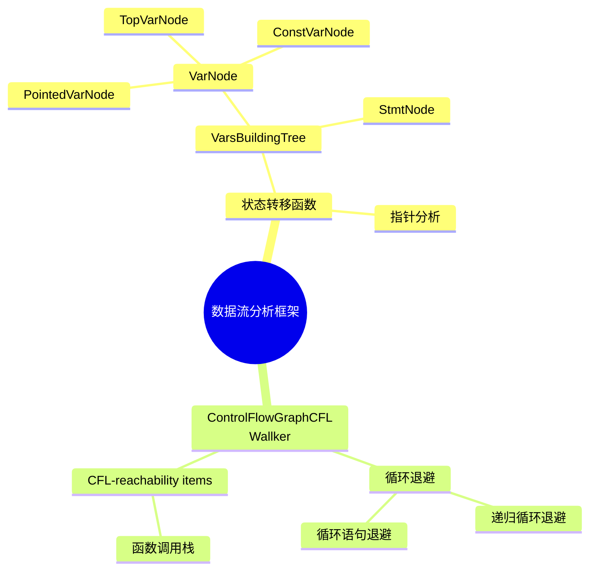
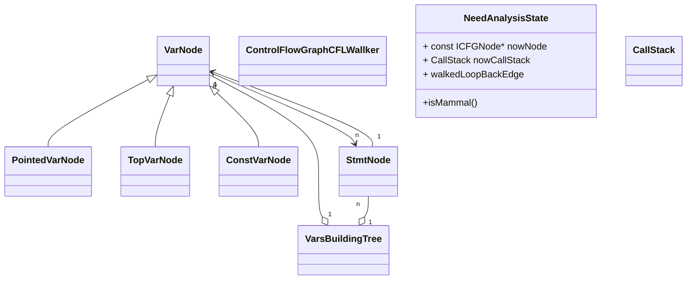

# 概述

数据流分析框架提供一个工作集算法
状态转移函数负责处理一个ICFGNode
处理完一个ICFGNode后ControlFlowGraphCFLWallker觉得下面要处理那些ICFGNode


# 任务一：确认关键数据结构
关键数据结构：
```
callStack = Vector[call ICFGNode指针] 
基本块 = 基本块ID + callStack

StmtNode = StmtNode ID + callStack + ICFGNode指针 + 入参合集
入参合集 = Vector[VarNode]
VarNode = VarNode ID + def语句合集 + [PointedVarNode | TopVarNode | ConstVarNode]
PointedVarNode = VFGNode指针 + Vector[该变量指向的addrVFGNode]
TopVarNode = LLVM IR 函数名 + 表示符
ConstVarNode = 常量值 + 常量类型
def语句合集 = Vector[StmtNode]
根节点 = VarNode
构建树 = 根节点

CFL-reachability items = nowNode + callStack
nowNode = ICFGNode指针

```
构建树中，StmtNode和其入参的VarNode的关联关系是稳定的，在StmtNode中维护vector<unique_ptr>。
构建树中用 unordered_map<unique_ptr>存所有StmtNode，VarNode中用裸指针维护对应关系。


# 任务二：声明对象

